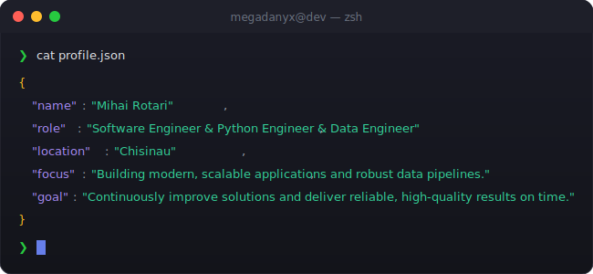

<div align="center">
  
  <!-- ═══════════════════════════════════════════════════════════════════════════ -->
  <!-- 🎯 ANIMATED HEADER                                                          -->
  <!-- ═══════════════════════════════════════════════════════════════════════════ -->
  
  
  
  <br/>
  
  <!-- ═══════════════════════════════════════════════════════════════════════════ -->
  <!-- 📊 PROFILE BADGES                                                           -->
  <!-- ═══════════════════════════════════════════════════════════════════════════ -->
  
  <a href="https://github.com/megadanyx">
    
  </a>
  &nbsp;
  <a href="https://github.com/megadanyx?tab=repositories">
    
  </a>
  &nbsp;
  <a href="https://github.com/megadanyx?tab=followers">
    
  </a>
  &nbsp;
  <a href="https://github.com/megadanyx">
    
  </a>
  
</div>

<br/>

<!-- ═══════════════════════════════════════════════════════════════════════════ -->
<!-- 🖥️ TERMINAL INTRO SECTION                                                   -->
<!-- ═══════════════════════════════════════════════════════════════════════════ -->

<div align="center">
  
</div>

<br/>


<br/>

<!-- ═══════════════════════════════════════════════════════════════════════════ -->
<!-- 👤 ABOUT ME SECTION                                                          -->
<!-- ═══════════════════════════════════════════════════════════════════════════ -->


<br/><br/>


<table>
<tr>
<td width="45%" valign="top">

### 🎯 What I Do

```yaml
name: Mihai Rotari
located_in: Chișinău, Moldova 🇲🇩
current_status: Software Engineer | Data Engineer

areas_of_expertise:
  - 🐍 Python Backend Development
  - 📊 Data Engineering & ETL
  - 🗄️ Database Design & Optimization
  - 🌐 Web Application Development
  - 💳 Payment Systems Processing

core_stack:
  - Django / Flask / FastAPI
  - MS SQL Server / MySQL / SQLite
  - Pandas / NumPy / Power BI
  - REST APIs & System Integrations

life_philosophy: "Build scalable systems that deliver reliable results."
```
</td>
<td width="55%" valign="top">

### 🚀 Current Focus

- 🔌 **Backend architecture & APIs**
- 💳 **Payment system reliability**
- 🗄️ **DB performance & query tuning**
- 🔄 **Automation & reporting**
- ⚡ **Scalable ETL pipelines**
<br/>

### 💡 Quick Facts

- 📍 Chișinău, Moldova
- 🌍 RO (Native) | RU (Fluent) | EN (Professional)
- 🏦 Banking & payment systems background
- 🛠 VS Code | SSMS | DBeaver | Git
- 📁 DVS-Expert | Data Pipeline | MyPos

</td>
</tr> </table>


<br/>


<br/>

<!-- ═══════════════════════════════════════════════════════════════════════════ -->
<!-- 🏆 ACHIEVEMENTS SECTION                                                     -->
<!-- ═══════════════════════════════════════════════════════════════════════════ -->


<br/><br/>

<div align="center">
  
  <!-- GitHub Trophies -->
  <a href="https://github.com/ryo-ma/github-profile-trophy">
    
  </a>
  
</div>

<br/>


<br/>

<!-- ═══════════════════════════════════════════════════════════════════════════ -->
<!-- 📊 GITHUB ANALYTICS                                                         -->
<!-- ═══════════════════════════════════════════════════════════════════════════ -->


<br/><br/>

<div align="center">
  
  <!-- GitHub Stats + Custom Streak in ONE ROW -->
  <a href="https://github.com/megadanyx">
    
  </a>
  &nbsp;
  <a href="https://github.com/megadanyx">
    
  </a>
  
  <br/><br/>
  
  <!-- 📊 REAL-TIME LANGUAGE USAGE WITH PROGRESS BARS -->
  <a href="https://github.com/megadanyx">
    
  </a>
  
  <br/><br/>
  
  <!-- Activity Graph -->
  <a href="https://github.com/megadanyx">
    
  </a>
  
  <br/><br/>
  
  <!-- Additional Stats Cards -->
  
  
</div>

<br/>


<br/>

<!-- ═══════════════════════════════════════════════════════════════════════════ -->
<!-- 🎮 CONTRIBUTION SHOWCASE                                                    -->
<!-- ═══════════════════════════════════════════════════════════════════════════ -->


<br/><br/>

<div align="center">
  
  <!-- Pac-Man Contribution Graph -->
  <picture>
    <source media="(prefers-color-scheme: dark)" srcset="./assets/pacman-contribution-graph-dark.svg"/>
    <source media="(prefers-color-scheme: light)" srcset="./assets/pacman-contribution-graph.svg"/>
    
  </picture>
  
  <br/>
  
  <sub>👾 Watch Pac-Man devour my contributions!</sub>
  
</div>

<br/>


<br/>

<!-- ═══════════════════════════════════════════════════════════════════════════ -->
<!-- ⚡ TECH STACK                                                               -->
<!-- ═══════════════════════════════════════════════════════════════════════════ -->


<br/><br/>

<div align="center">

<!-- 💻 LANGUAGES -->
<h4>💻 Languages</h4>
<p>
  <a href="https://www.python.org/" target="_blank"></a>
  <a href="https://developer.mozilla.org/en-US/docs/Web/JavaScript" target="_blank"></a>
  <a href="https://www.php.net/" target="_blank"></a>
  <a href="https://isocpp.org/" target="_blank"></a>
  <a href="https://www.gnu.org/software/bash/" target="_blank"></a>
</p>

<!-- 🌐 WEB DEVELOPMENT -->
<h4>🌐 Web Development</h4>
<p>
  <a href="https://www.djangoproject.com/" target="_blank"></a>
  <a href="https://flask.palletsprojects.com/" target="_blank"></a>
  <a href="https://nodejs.org/" target="_blank"></a>
  <a href="https://reactjs.org/" target="_blank"></a>
  <a href="https://nextjs.org/" target="_blank"></a>
  <a href="https://laravel.com/" target="_blank"></a>
  <a href="https://getbootstrap.com/" target="_blank"></a>
  <a href="https://developer.mozilla.org/en-US/docs/Web/HTML" target="_blank"></a>
  <a href="https://developer.mozilla.org/en-US/docs/Web/CSS" target="_blank"></a>
</p>

<!-- 🗄️ DATABASES -->
<h4>🗄️ Databases</h4>
<p>
  <a href="https://www.microsoft.com/en-us/sql-server" target="_blank"> </a>
  <a href="https://www.mysql.com/" target="_blank"></a>
  <a href="https://www.postgresql.org/" target="_blank"></a>
  <a href="https://www.sqlite.org/" target="_blank"></a>
  <!-- <a href="https://redis.io/" target="_blank"></a> -->
  <!-- <a href="https://firebase.google.com/" target="_blank"></a> -->
  <!-- <a href="https://www.mongodb.com/" target="_blank"></a> -->
</p>

<!-- 🔧 TOOLS & PLATFORMS -->
<h4>🔧 Tools & Platforms</h4>
<p>
  <a href="https://git-scm.com/" target="_blank"></a>
  <a href="https://www.docker.com/" target="_blank"></a>
  <a href="https://www.linux.org/" target="_blank"></a>
  <a href="https://code.visualstudio.com/" target="_blank"></a>
  <a href="https://www.figma.com/" target="_blank"></a>
  <a href="https://www.postman.com/" target="_blank"></a>
  <!-- <a href="https://azure.microsoft.com/" target="_blank"></a> -->
  <!-- <a href="https://vercel.com/" target="_blank"></a> -->
</p>

</div>

<br/>


<!-- ═══════════════════════════════════════════════════════════════════════════ -->
<!-- 🌐 CONNECT WITH ME                                                          -->
<!-- ═══════════════════════════════════════════════════════════════════════════ -->


<br/><br/>

<div align="center">
  
<a href="https://github.com/megadanyx" target="_blank">
  
</a>
&nbsp;
<a href="https://www.linkedin.com/in/mihai-rotari-324141201" target="_blank">
  
</a>
&nbsp;
<a href="https://www.codewars.com/users/megadanyx@gmail.com" target="_blank">
  
</a>
&nbsp;
<a href="mihai.rotari.nicolai@gmail.com">
  
</a>

</div>

<br/>


<br/>

<!-- ═══════════════════════════════════════════════════════════════════════════ -->
<!-- 💡 RANDOM DEV QUOTE                                                         -->
<!-- ═══════════════════════════════════════════════════════════════════════════ -->

<div align="center">
  
### 💭 Random Dev Quote

<br/>

<a href="https://github.com/megadanyx">
  
</a>

</div>

<br/>

<!-- ═══════════════════════════════════════════════════════════════════════════ -->
<!-- 🌟 FOOTER                                                                   -->
<!-- ═══════════════════════════════════════════════════════════════════════════ -->


<!-- ═══════════════════════════════════════════════════════════════════════════ -->
<!-- 📝 END OF README                                                            -->
<!-- ═══════════════════════════════════════════════════════════════════════════ -->
